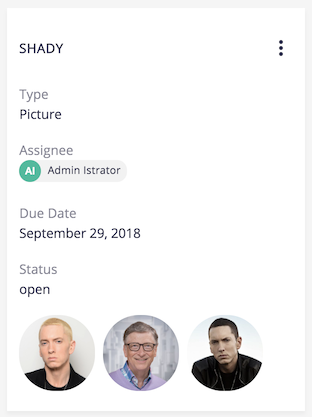

# About

[](https://qa.nuxeo.org/jenkins/job/Sandbox/job/sandbox_nuxeo-labs-thumbnails-enricher-master/)

This Nuxeo Package contains a new [Enricher](https://doc.nuxeo.com/n/M8o) named `thumbnails`, for Folderish document types, to get the thumbnails of the children. This can be useful for displaying thumbnail images when looking at the parent, for example.




# Usage

* You can limit the number of results by setting the header `thumbnail-limit` to a number
* You can filter the children by type by setting the header `thumbnail-types` to a comma-separated list of types
* You can filter the children by facet by setting the header `thumbnail-facets` to a comma-separated list of facets

The result format is:

```
"contextParameters": {
 "thumbnails": [
   {
     "id": <doc-id>
     "thumbnailUrl": <thumbnail-url>
   },
   ...
 ]
}
```

# Build

Building requires the following software:

* git
* maven

```
git clone https://github.com/nuxeo-sandbox/nuxeo-labs-thumbnails-enricher
cd nuxeo-labs-thumbnails-enricher
mvn clean install
```

## Install

The build will produce a Nuxeo Pacakage in the folder `nuxeo-labs-thumbnails-enricher-package/target`. If you need help installing Nuxeo Packages, refer to [the documentation](https://doc.nuxeo.com/n/lHZ).

# Support

**These features are not part of the Nuxeo Production platform.**

These solutions are provided for inspiration and we encourage customers to use them as code samples and learning resources.

This is a moving project (no API maintenance, no deprecation process, etc.) If any of these solutions are found to be useful for the Nuxeo Platform in general, they will be integrated directly into platform, not maintained here.

# License

[Apache License, Version 2.0](http://www.apache.org/licenses/LICENSE-2.0.html)

# About Nuxeo

Nuxeo Platform is an open source Content Services platform, written in Java. Data can be stored in both SQL & NoSQL databases.

The development of the Nuxeo Platform is mostly done by Nuxeo employees with an open development model.

The source code, documentation, roadmap, issue tracker, testing, benchmarks are all public.

Typically, Nuxeo users build different types of information management solutions for [document management](https://www.nuxeo.com/solutions/document-management/), [case management](https://www.nuxeo.com/solutions/case-management/), and [digital asset management](https://www.nuxeo.com/solutions/dam-digital-asset-management/), use cases. It uses schema-flexible metadata & content models that allows content to be repurposed to fulfill future use cases.

More information is available at [www.nuxeo.com](https://www.nuxeo.com).
